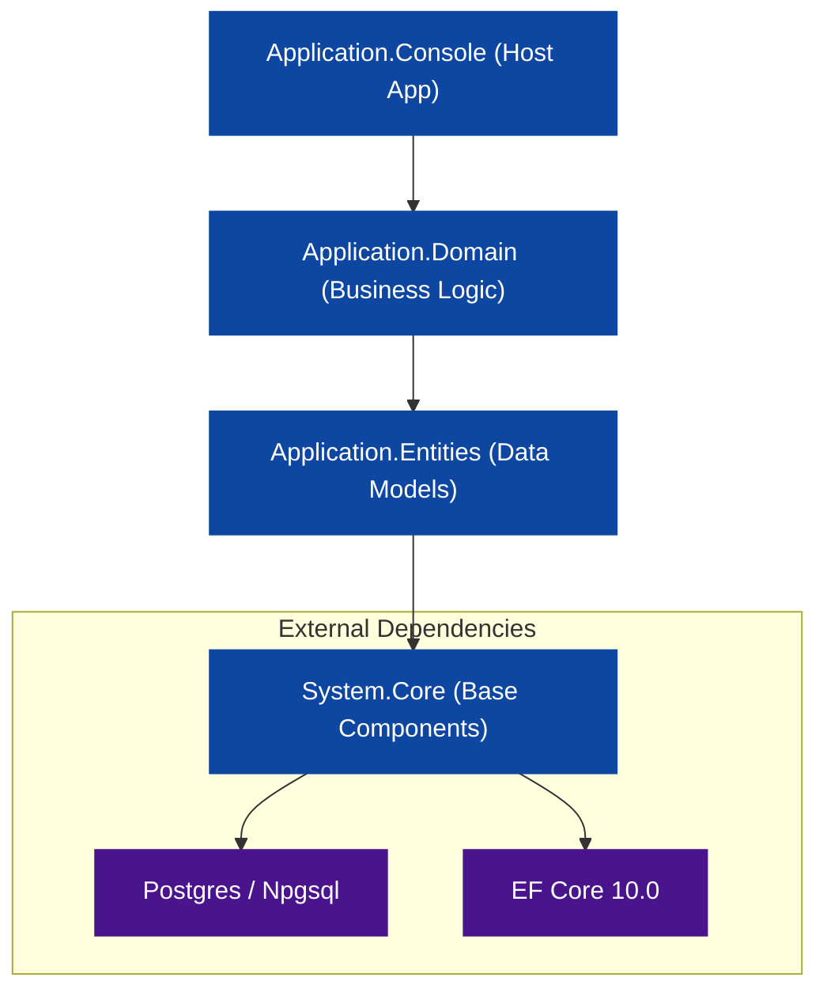

# DingTechTest - Multi-Tenant Billing System

A modern, high-performance **Multi-Tenant Billing System** built with **.NET 10.0** and **PostgreSQL**. This project follows clean architecture principles and is containerized for easy development and deployment.

---

## 🛠️ Tech Stack

### Backend

- **Framework**: [.NET 10.0 (Preview/Latest)](https://dotnet.microsoft.com/)
- **Application Type**: Console Application (Host-based)
- **ORM**: [Entity Framework Core](https://learn.microsoft.com/en-us/ef/core/) with **Npgsql**
- **Architecture**: Domain-Driven Design (DDD)
- **Dependency Injection**: Integrated ASP.NET Core DI
- **Containerization**: [Docker](https://www.docker.com/) & [Docker Compose](https://docs.docker.com/compose/)

### Frontend (Upcoming)

- **Framework**: [Angular](https://angular.io/) (Planned)

### Database

- **Primary DB**: [PostgreSQL 17+](https://www.postgresql.org/)
- **Identity & Auth**: Integrated Identity System (Consolidated into Application Database)

---

## 🚀 Getting Started

To get the project up and running locally, follow these steps:

### Prerequisites

- [Docker Desktop](https://www.docker.com/products/docker-desktop/) (recommended)
- [.NET 10 SDK](https://dotnet.microsoft.com/download) (if running without Docker)
- [PostgreSQL](https://www.postgresql.org/download/) (if running without Docker)

### Run with Docker Compose (Recommended)

This is the easiest way to start both the console application and the database.

1. **Navigate to the Docker directory**:

   ```powershell
   cd docker-containers
   ```

2. **Configure Environment Variables**:
   - Open the `.env` file in the `docker-containers` folder.
   - Adjust the credentials or ports if necessary. (Note: `.env` is ignored by git for security).

3. **Start the Services**:

   ```powershell
   docker-compose up -d --build
   ```

   - **Console App**: Available as `ding-tech-console` container.
   - **Postgres DB**: Available at `localhost:5432`

---

## 🏗️ Architecture & Dependencies

The project follows a modular architecture where each layer has a specific responsibility:



---

## 📁 Project Structure

- `src/Application.Console`: The main entry point for the background/console application.
- `src/Application.Domain`: Contains business logic, interfaces, and domain models.
- `src/Application.Entities`: Database models and Entity Framework DbContext.
- `src/System.Core`: Shared libraries, generic repositories, and utility functions.
- `docker-containers/`: Docker Compose and environment configurations.

---

## 📝 License

This project is licensed under the [MIT License](LICENSE).